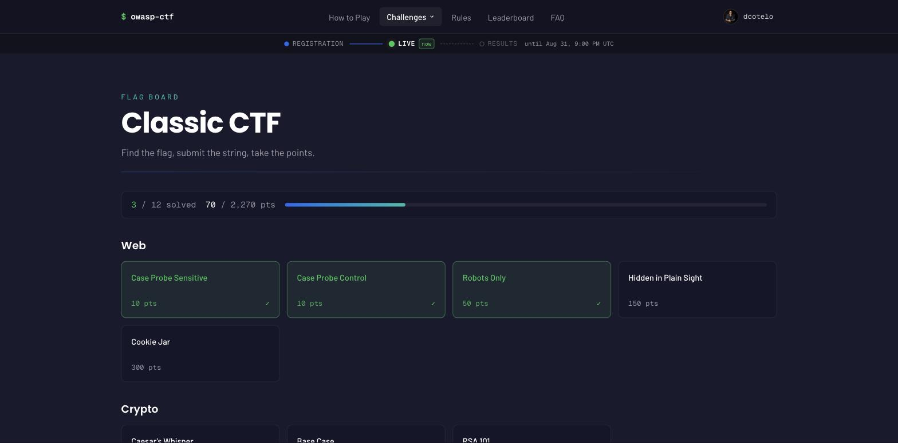
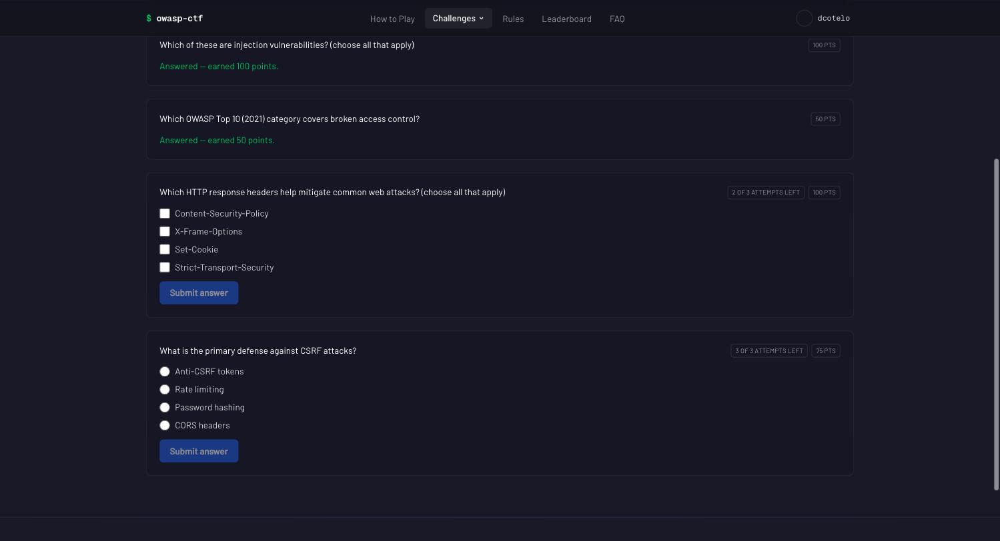
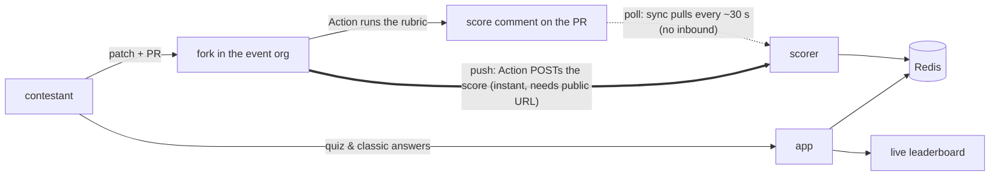

<h1 align="center">🛡 CTF-in-a-box</h1>

<p align="center">
  <em>A self-hosted control plane for security-learning events — one box, one free GitHub org.<br>
  Run it for a university, a high school, an OWASP chapter, a meetup.</em>
</p>

<p align="center">
  <a href="https://github.com/dcotelo/ctf-in-a-box/actions/workflows/ci.yml"></a>
  <a href="https://dcotelo.github.io/ctf-in-a-box/"></a>
  <a href="LICENSE"></a>
</p>

<p align="center">
  
</p>

### Working on the kit (humans and agents)

Read [`AGENTS.md`](AGENTS.md) before you write code. It is the operating
manual: the exact commands CI runs, the failure modes this repo has
already hit, and the review invariants in
[`docs/reviewing.md`](docs/reviewing.md). `CLAUDE.md` is a pointer to
the same file.

A change is ready when CI is green **and** every actionable CodeRabbit
thread on the latest commit is resolved (or declined on the record).
Commits follow Conventional Commits and carry no AI attribution.

Small, well-specified work is tagged
[`good first issue`](https://github.com/dcotelo/ctf-in-a-box/issues?q=is%3Aissue+is%3Aopen+label%3A%22good+first+issue%22).
New modules start as an issue, not a PR — see
[`docs/modules.md`](docs/modules.md) section 9.

## What this is

**A control plane, not a single game.** The box gives an event its shared
spine — a GitHub org, team registration, a live leaderboard, an organizer
admin panel, and the scoring pipeline that feeds it. **Modules** plug
challenge content into that spine, and any subset can run alone or together:
patch-to-score **Secure Development**, a **Quiz** bank, a jeopardy-style
**Classic CTF** board, and externally hosted **AI** challenges. The [module
contract](docs/modules.md) is the boundary
between spine and content, so the box is built to host further modules —
forensics, API-security, cloud — as they land.

**Why it exists.** The Secure Development CTF teaches defence rather than
attack, and it is a genuinely good way to teach secure coding. Until now,
running one meant standing up Vercel, Upstash, Lambda and DynamoDB, holding
the cloud bill, and having access to a private scoring image. That is a
reasonable ask for a conference with a budget. It is an unreasonable ask for
a university security course, a high-school club, an OWASP chapter night, or
a weekend workshop.

This kit removes it. Everything runs from Docker Compose on one machine you
already have — a laptop, a spare desktop, a small VPS — plus one free GitHub
org for the forks. The rubrics for all six targets ship inside the box, so
there is no private image to request and no scoring code to write. Nothing is
billed, nothing phones home, and when the event ends you archive the repos
and stop the stack.

**Who it's for:** anyone who wants to run this event and does not want to
become a cloud operator to do it — course instructors, club organizers, OWASP
chapter leads, workshop facilitators, security teams running an internal
training day.

## Status

**Complete and tested offline; not yet validated against a real live event.**
The full scoring path ships in-kit — the scorer's bearer-authed `POST /score`,
the self-contained scoring workflow for the forks, poll and push transport —
and `scripts/smoke.sh` exercises the whole poll pipeline end to end against
mocks. What has *not* happened yet is a real event driving real contestant
PRs through real GitHub. Two known caveats, in the open: the Security
Shepherd result matcher has a stated residual limit (an unusually-phrased
refusal can still read as a solve — it can under-credit a correct patch,
never award a free point), and the app's Redis client has not been verified
end-to-end against the srh proxy's subset of the Upstash REST API. Detail and
current state: [Status and upstream
dependencies](docs/operations.md#status-and-upstream-dependencies).

## What it is not

- **Not a general CTF platform.** [CTFd](https://ctfd.io/) is mature,
  battle-tested, and has a large plugin ecosystem — if you want a
  conventional jeopardy or attack-defense event with maximum flexibility,
  use CTFd. This kit's Classic module is deliberately smaller than CTFd.
- **Not a hosted practice gym.** [picoCTF](https://picoctf.org/) gives you
  curriculum and challenges with zero operations — if you don't need to run
  your *own* event with your own content and roster, it's the better answer.
- **Not an attack trainer.** The flagship module grades *patches*, not
  exploits. Contestants fix vulnerabilities and a pipeline proves the fix.

What it does that those don't: patch-to-score defence training graded through
GitHub pull requests, a module contract for mixing game types on one
leaderboard, and a control plane you own end to end — one box, one free org,
no cloud bill, no telemetry.

This project is **not affiliated with or endorsed by the OWASP Foundation**.
Four of the six vulnerable targets are OWASP projects (Juice Shop, WebGoat,
Security Shepherd, VulnerableApp); DVWA and VAmPI are community projects.

## Quickstart

**See it running in two minutes** — no GitHub org, no OAuth app, nothing to
configure. You need **Docker with Compose v2** and **`openssl`**:

```sh
git clone https://github.com/dcotelo/ctf-in-a-box
cd ctf-in-a-box
./scripts/dev-stack up
```

It writes throwaway local secrets, builds the scorer and app images, brings
the stack up, seeds a demo leaderboard through the scorer's real scoring API,
and prints the URL to open. You should see the leaderboard with seeded teams
and a score-over-time graph; `./scripts/dev-stack score <login> juice-shop 3`
lands three more solves live. `./scripts/dev-stack down` tears it down.

**Run a real event** with the guided wizard. Add the **[`gh`
CLI](https://cli.github.com)** (authenticated) and **one free GitHub org**;
`./setup/ctf-setup.sh check` verifies the tooling first:

```sh
./setup/ctf-setup.sh            # guided, prompts for values, resumable
```

It asks for each value as it goes — your box URL, the event details, which
modules to run, the GitHub credentials — writes `.env` and `event.yaml`, does
every automatable step, guides you through the GitHub-UI ones, and resumes if
you stop and come back. It asks only what the modules you enabled actually
need: a quiz-only or classic-only event needs no org, no forks, and no scorer
image, and is never asked about them. Preview any mutating step with
`--dry-run`; once provisioned, `./setup/ctf-setup.sh doctor` shows a per-fork
status matrix.

<p align="center">
  
</p>

**Want the details?** Every discrete subcommand, each UI-only step, and how
the two GitHub apps differ:
[docs/hosting.md](docs/hosting.md#quickstart-zero-to-a-scored-event).
**On a cloud VM instead?** [docs/aws.md](docs/aws.md) (single-shot Terraform,
`apply` up / `destroy` down) or [docs/fly.md](docs/fly.md) (one Fly machine).

## The modules

**Secure Development** — fork a deliberately vulnerable app, find the flaw,
**patch** it, open a PR. A GitHub Action in the fork runs the target's rubric
against the patch and the score lands on the leaderboard (~30 s later in poll
mode). Six targets, 321 challenges; stock scores 0, a correct patch earns its
points — gated in both directions. Needs the GitHub org and the scoring
pipeline.

**Quiz** — single- and multi-select security questions, graded in the app
the moment they're answered (all-or-nothing on multi-select), with an attempt
cap and retry cooldown. Authored from `/admin` one at a time or imported and
exported as one JSON bundle. Needs no GitHub, no forks, no pipeline.

**Classic CTF** — a jeopardy-style board of organizer-authored flags in
categories. Submissions are trimmed and normalised, casing forgiven unless a
flag is marked case-sensitive (its card says so), with a submission cooldown
and optional paid hints. Same `/admin` + JSON-bundle authoring as the quiz.
Needs no GitHub either.

**AI Challenges** — prompt-injection and guardrail challenges hosted outside
the box. Each contestant's challenge page mints them a personal launch link
to the external site; a solve reports back to the leaderboard, either
through that site's own callback or a flag typed back into the app. Needs no
GitHub, no forks, no pipeline.

Around whichever modules you enable, the platform provides: team
self-registration with captains, join codes and `/join/<code>` links (solo
play is a team of one; a flag solved by several teammates counts once); the
live leaderboard with a CTFd-style score-over-time graph from real per-solve
timestamps; the allowlisted `/admin` panel — freeze, scoring and registration
windows, hints and costs, team cap, cooldowns, module content, per-contestant
support actions, an activity stream and engagement metrics — all runtime, no
rebuild; and a capped audit log on every admin action.

| Contestant breakdown | Challenge browser |
|---|---|
|  |  |

| Classic flag board | Quiz |
|---|---|
|  |  |

<sup>Captured from the contestant app running locally via <code>scripts/dev-stack up</code>
with seeded demo players. The event name, branding, targets and links are all
event-config driven.</sup>

## How it works

One Docker Compose stack: Caddy terminates TLS in front of the Next.js app;
the app talks to Redis only through srh (an Upstash-compatible REST proxy) —
the network is split so nothing internet-facing has a route to `redis:6379`.
Quiz, Classic and AI grade inside the app and bank points straight to Redis.
Secure Development is graded *outside* the box: the contestant's fork runs a
GitHub Action that boots the target, runs the rubric against the patch, and
posts a machine-readable score comment on the PR. The `sync` poller pulls
those comments (poll mode — zero inbound network surface, works behind NAT
and venue wifi) or the Action POSTs directly (push mode — near-instant, needs
a public URL). Either way the score enters through a single audited writer:
the scorer's bearer-authed `POST /score`, which validates and writes
monotonically — solves are never un-solved by a later failing run.



The full picture — components, the nine-step score data flow, the security
model — is in [docs/architecture.md](docs/architecture.md).

## Secure Development: targets and rubrics

This module's content is a set of vulnerable **targets** and their scoring
**rubrics**. Contestants pick a target, fork the org's copy, patch it, and
open a PR. Each target's challenges are executable `node:test` suites, priced
by difficulty.

| Target | Challenges | Points | Notes |
|---|---:|---:|---|
| `vulnerableapp` | 110 | 187 | Largest target; scored 8-way parallel |
| `webgoat` | 69 | 137 | Two-stage build: Maven, then the fork's runtime-only Dockerfile |
| `dvwa` | 55 | 108 | Needs a MariaDB sibling and a schema init |
| `securityshepherd` | 40 | 79 | HTTPS, three-container stack, strictly serial |
| `juice-shop` | 38 | 141 | The only target whose difficulty runs to 6 stars |
| `vampi` | 9 | 16 | Self-contained; the quickest end-to-end proof |
| **Total** | **321** | **668** | Enable any subset in `modules.secure-development.targets` |

<sup>Counts are maintained by hand and pinned to the vendored rubric by
<code>apps/web/src/lib/__tests__/apps-catalogue.test.ts</code> — re-check them
after a <code>vendor-rubric.sh</code> bump. Reference <strong>patches</strong>
that prove a correct fix scores (the positive-direction gate) live separately
under <a href="patches/README.md"><code>patches/</code></a>.</sup>

The rubrics live in `scorer/rubric.owasp/`, vendored from
[OWASP-CTF/dc34-owasp-secure-development-ctf](https://github.com/OWASP-CTF/dc34-owasp-secure-development-ctf)
and pinned to the single upstream commit recorded in
`scorer/rubric.owasp/PROVENANCE.md`. Re-vendor against a newer commit with:

```sh
./scripts/vendor-rubric.sh --all --ref <sha>
```

Two rubric shapes are supported at once, and a single rubric directory may mix
them: `<target>.yaml` files use the declarative HTTP request/expect probe
grammar, and `<target>/tests/challenges/` directories use executable tests
priced by `catalogue.<target>.json`. Authoring guide:
[docs/scorer.md](docs/scorer.md).

**On rubric secrecy.** These rubrics are public. The targets are open source
and their solutions are already published, so the kit treats rubric privacy as
protection against check-gaming rather than against knowing the answers — an
accepted trade-off for a self-hosted event. Override with your own private
rubric at any time:

```sh
cp -r /path/to/private-rubric scorer/rubric
docker build -t ghcr.io/<org>/score:latest --build-arg RUBRIC_DIR=rubric scorer/
```

`scorer/rubric/` is gitignored and reserved for exactly this.

## Running an event

Once the stack is up at your `EVENT_URL`:

- **Contestants** sign in with GitHub and form or join a team — a team is
  required to score, and **Play solo** makes a team of one in a click. Then
  they play whichever modules you enabled: patch-and-PR for secure
  development, answer and submit in the app for quiz and classic, or open a
  personal launch link for ai.
- **Organizers** drive `/admin`: freeze the leaderboard, open and close
  registration, set the schedule, author quiz questions, classic challenges
  and ai challenges — and when one contestant gets stuck, fix that one
  contestant rather than resetting the event.
- **Watch the poller** with `docker compose logs -f sync` (poll mode, with
  `secure-development` enabled). All state lives in named Docker volumes, so
  a box reboot loses nothing.
- **When it's over**, `./setup/ctf-setup.sh teardown` archives the target
  repos — then uninstall the GitHub App and delete the org's Actions secrets
  yourself. An event without `secure-development` has no forks to archive.

Teams, the admin panel, verifying the kit before the day, and the local
dev-stack are all covered in [docs/operations.md](docs/operations.md);
prerequisites, poll-vs-push, OAuth setup and event config in
[docs/hosting.md](docs/hosting.md).

## Why it is built this way

- **Self-contained, no cloud.** Everything runs from Docker Compose on one box
  plus one free GitHub org. The rubric ships in the kit — no private image to
  request, no scoring code to write — and everything survives a reboot on named
  Docker volumes.
- **Stock scores zero, a patch earns its points.** Every target is gated: a
  test that passes against the *unpatched* app would be a free point for every
  contestant, so the build refuses to ship it.
- **Poll mode has zero inbound network surface.** Nothing has to reach your box
  — it polls GitHub for score comments — so a campus network, a locked-down
  lab, or venue wifi works without a firewall change.

The full reasoning, alternatives, and trade-offs are recorded as numbered ADRs
in [docs/decisions.md](docs/decisions.md).

## Documentation

| Read this when you're… | Document |
|---|---|
| Standing the kit up | [docs/hosting.md](docs/hosting.md) — prerequisites, the wizard and every discrete step, poll vs push, the GitHub OAuth app, event config |
| Deploying to a cloud VM | [docs/aws.md](docs/aws.md) (Terraform, one EC2 box) · [docs/fly.md](docs/fly.md) (one Fly machine) |
| About to open the doors | [docs/security-checklist.md](docs/security-checklist.md) — the one-page pre-event walk |
| Running the event | [docs/operations.md](docs/operations.md) — teams, the admin panel, the quiz/classic/ai organizer guides, verifying, teardown |
| Understanding the system | [docs/architecture.md](docs/architecture.md) — diagram, score data flow, Redis keys, security model, testing strategy |
| Writing a rubric | [docs/scorer.md](docs/scorer.md) — serve + judge modes, both rubric grammars, authoring and building |
| Building a new module | [docs/modules.md](docs/modules.md) — the platform/module contract |
| Asking "why is it like this?" | [docs/decisions.md](docs/decisions.md) — numbered ADRs |

Rendered at **[dcotelo.github.io/ctf-in-a-box](https://dcotelo.github.io/ctf-in-a-box/)**.

## Contributing and security

Contributions welcome — [CONTRIBUTING.md](CONTRIBUTING.md) covers the dev
environment, the CI gates, and how to propose a module;
[CODE_OF_CONDUCT.md](CODE_OF_CONDUCT.md) applies.

Agents should follow [AGENTS.md](AGENTS.md). The commands below match CI;
`make help` lists the same targets.

Each service tests independently (Node 22 across the board):

```sh
(cd sync && npm ci && npm test)
(cd scorer && npm ci && npm test && node tools/vacuous-sweep.mjs)
./scripts/acceptance-scorer.sh  # from the repo root — the script lives in scripts/
(cd apps/web && corepack pnpm install --frozen-lockfile && corepack pnpm lint && corepack pnpm test)
./scripts/smoke.sh              # the full poll pipeline, end to end
```

Found a vulnerability in the kit itself? **[SECURITY.md](SECURITY.md)** — the
targets' vulnerabilities are intentional and out of scope.

## License and credits

MIT — see [LICENSE](LICENSE). The rubric content under `scorer/rubric.owasp/`
is vendored from the upstream
[OWASP-CTF](https://github.com/OWASP-CTF/dc34-owasp-secure-development-ctf)
event, pinned to the commit in `scorer/rubric.owasp/PROVENANCE.md` — this kit
exists because that event was worth running more than once. The vulnerable
targets are not vendored: events fork them from their own upstreams
([Juice Shop](https://github.com/juice-shop/juice-shop),
[WebGoat](https://github.com/WebGoat/WebGoat),
[DVWA](https://github.com/digininja/DVWA),
[Security Shepherd](https://github.com/OWASP/SecurityShepherd),
[VulnerableApp](https://github.com/SasanLabs/VulnerableApp),
[VAmPI](https://github.com/erev0s/VAmPI)), and each keeps its own license.
OWASP® is a registered trademark of the OWASP Foundation; this project is not
affiliated with or endorsed by it.
