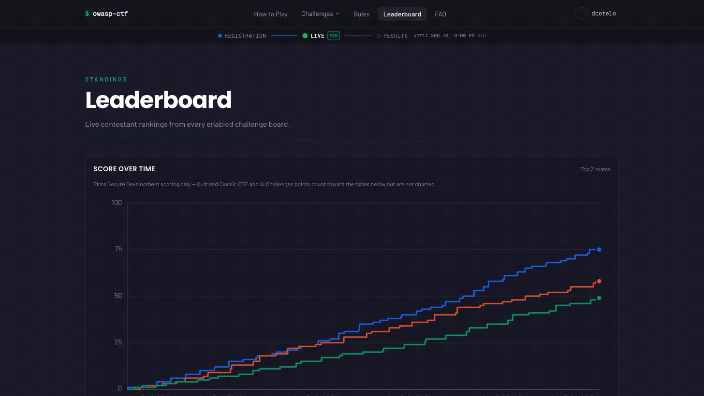
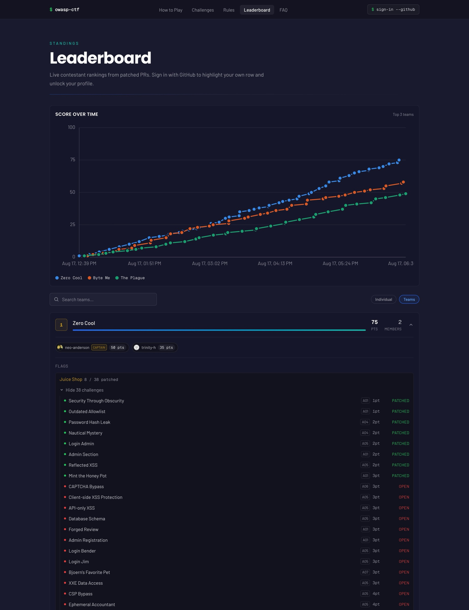
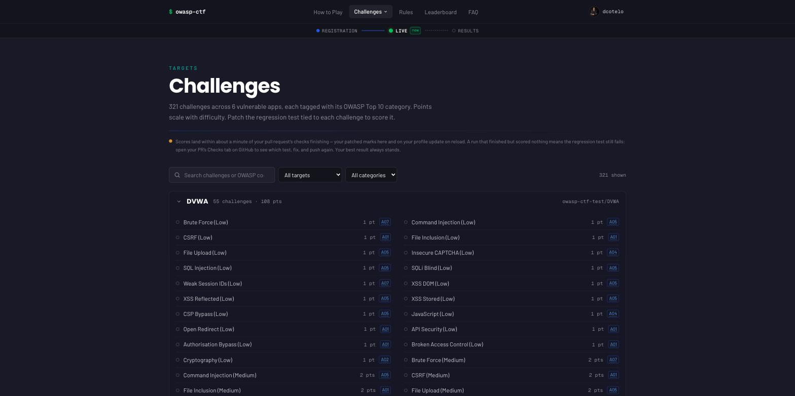

# CTF-in-a-box

Self-hosted OWASP CTF: run the OWASP Secure Development CTF — the patch-the-vulnerability format
(fork target app → find + patch the vuln → PR back → GitHub Actions scores
the patch) on your own hardware. One box, one free GitHub org, no cloud
dependencies. See
[OWASP-CTF/dc34-owasp-secure-development-ctf](https://github.com/OWASP-CTF/dc34-owasp-secure-development-ctf)
for the underlying spec and target apps.

Contestants sign in, pick from up to six vulnerable target apps
(`juice-shop`, `dvwa`, `webgoat`, `securityshepherd`, `vulnerableapp`,
`vampi`), fork the org's copy, patch it, and open a PR. A GitHub Action
scores the PR and the score lands on your box's leaderboard — either pushed
in directly or picked up by a poller, depending on your network.

## What contestants see



| Leaderboard | Challenge browser |
|---|---|
|  |  |

Captured from the contestant app running locally in mock-data mode (no
backend configured — the app ships demo data by design, so the kit is
inspectable before any event exists). Event name, dates, targets, and
branding now come from `event.yaml` at image-build time — see
[Rebuilding the app after a config change](#rebuilding-the-app-after-a-config-change).
These screenshots predate that work and were captured from a
DEF CON 34-branded build, so they're stale against the neutral "OWASP CTF"
default a fresh build now ships; re-capturing them is a follow-up, not done
here. An organizer admin panel (score adjustments, player removal, hint
toggles) is still planned and will be documented here with its own
screenshots when it lands.

## Prerequisites

- Docker with Compose v2 (`docker compose version` must work).
- [`gh` CLI](https://cli.github.com), authenticated (`gh auth login`).
- A GitHub org for the event (create one free org per event; see
  [Poll vs push](#poll-vs-push) and [After the event](#after-the-event)).
- Read access to `ghcr.io/owasp-ctf/score` — request it from the
  OWASP-CTF "self-host organizers" team. The scorer image bakes in the
  challenge rubric and stays private; `ctf-setup org` mirrors it into your
  own event org so your forks' Actions can pull it.
- `docker login ghcr.io` with a token that has `write:packages`. The
  `org` subcommand's image-mirror step ends with
  `docker push ghcr.io/<org>/score:latest`, which needs write access to
  your event org's GHCR packages, not just read access to the upstream one.

## Quickstart

```sh
./setup/ctf-setup.sh check
./setup/ctf-setup.sh secrets
cp event.yaml.example event.yaml   # edit: org, targets, admins, url
./setup/ctf-setup.sh org           # fork targets, fetch workflow (manual install), mirror image
docker compose --profile poll --profile app up -d
```

`check` and `secrets` run before `event.yaml` exists — they only touch your
local tools and `.env`. `org` (and later `teardown`) need `event.yaml`
because they read `github.org` and `modules.secure-development.targets`
from it.

`secrets` writes `.env` with generated `BETTER_AUTH_SECRET`, `SRH_TOKEN`,
and `SCORER_TOKEN`, plus empty `GITHUB_CLIENT_ID` / `GITHUB_CLIENT_SECRET`
/ `GITHUB_PAT` for you to fill in (see [GitHub OAuth app](#github-oauth-app)
for the client id/secret; `GITHUB_PAT` is consumed at runtime by the `sync`
service for poll-mode comment polling, not by `ctf-setup.sh` — see
[Poll vs push](#poll-vs-push)). A classic-scope PAT with repo read on the
event org suffices. It refuses to overwrite an existing `.env`.

`event.yaml` uses a **modules** schema: platform settings (`event`,
`github`, `teams`, `hints`, `admins`) sit at the top level, and the actual
challenge content is namespaced under `modules.<name>`. v1 ships exactly one
module, `modules.secure-development`, holding the target list and a
`score_ingest` field that documents the intended poll/push mode (the
operative switch is `SCORE_INGEST` in `.env` — see [Poll vs
push](#poll-vs-push)). Future CTF verticals (forensics, API security, cloud,
...) are expected to plug in as sibling keys next to `secure-development`
without changing anything else in the file. Copy `event.yaml.example` and
fill in `github.org`, `modules.secure-development.targets` (any subset of
the six target keys above), `admins` (GitHub logins), and `event.url`.
What a module must provide to plug in — config block, scoring contract,
transports, security requirements, provisioning — is documented in
[docs/modules.md](docs/modules.md).

`ctf-setup.sh org` authenticates via your existing `gh auth login` session
(the same one `check` verifies) and your local `docker` login to
`ghcr.io` — it doesn't read `.env` at all. It forks each target into the
org, fetches and reports where to install the scoring workflow, and
mirrors the scorer image into your org's GHCR. Every subcommand takes
flags *after* the subcommand name, e.g. `./setup/ctf-setup.sh org --dry-run`
to preview without touching anything.

## Rebuilding the app after a config change

The contestant app (`apps/web/`, vendored — see
[`apps/web/VENDORED.md`](apps/web/VENDORED.md)) bakes its event name, dates,
URL, and enabled-target list from `event.yaml` in at image-build time, via
the `EVENT_CONFIG_B64` compose build arg. `docker compose --profile app up
-d` alone won't pick up an `event.yaml` edit — Compose only rebuilds an
image when told to. After changing `event.yaml`, rebuild the `app` image
explicitly:

```sh
EVENT_CONFIG_B64=$(base64 < event.yaml | tr -d '\n') docker compose --profile app build app
```

then bring the stack back up (`docker compose --profile poll --profile app
up -d`) to run the freshly built image. Leaving `EVENT_CONFIG_B64` unset (or
building without it) falls back to the neutral "OWASP CTF" defaults baked
into the vendored app — see `apps/web/scripts/generate-event-config.mjs` for
the full `EVENT_CONFIG` yaml > `EVENT_*` env var > default precedence.

## GitHub OAuth app

Contestants sign in with GitHub, so you need an OAuth app:

1. In the event org (or your personal account), create a new OAuth app.
2. Set the callback URL to `<EVENT_URL>/api/auth/callback/github`, where
   `EVENT_URL` is the value you set in `.env` — that's what Caddy and the
   app's auth flow actually use. (`event.yaml`'s `event.url` is a separate,
   unsynced field; see [Poll vs push](#poll-vs-push) for the same
   env-vs-config-file split with `SCORE_INGEST`.)
3. Put the client ID in `GITHUB_CLIENT_ID` and the client secret in
   `GITHUB_CLIENT_SECRET` in `.env`.

## Poll vs push

Scores travel from the scoring GitHub Action back to your box one of two
ways. **`SCORE_INGEST` in `.env` is the operative switch** — it's what
`docker-compose.yml` and the Caddy profile actually read.
`modules.secure-development.score_ingest` in `event.yaml` only documents the
organizer's intent for the same choice; nothing syncs the two, so keep them
matching yourself:

| Mode | How it works | Requirements | Latency |
|---|---|---|---|
| `poll` (default) | The `sync` service polls the org's target repos for score comments with your organizer PAT | Nothing extra — works behind NAT, on a laptop, anywhere | ~30 s |
| `push` | The scoring Action POSTs the score directly to your box | A public URL for the box; set `SCORE_INGEST=push` and org Actions secrets `LEADERBOARD_URL` / `LEADERBOARD_TOKEN` | Near-instant |

Push mode additionally depends on upstream item 2 below (`score-action`'s
`leaderboard-url`/`leaderboard-token` inputs) actually shipping — see
[Status / upstream dependencies](#status--upstream-dependencies). Poll mode
is what `scripts/smoke.sh` proves working today.

Poll mode has zero inbound network surface — nothing needs to reach your
box from the internet. Push mode needs `LEADERBOARD_URL` (the box's public
URL) and `LEADERBOARD_TOKEN` (a bearer token) set as secrets on the event
org, and Caddy only exposes the `/score` route externally when running
with the `push` Caddyfile.

Start the poll pipeline with `docker compose --profile poll --profile app up -d`
(the `poll` profile brings up the `sync` service; `app` brings up the
contestant-facing app). Push mode doesn't need the `sync` service running.

## During the event

- Leaderboard and app live at the `EVENT_URL` you configured in `.env`.
- Poller logs: `docker compose logs -f sync`.
- All state (Redis data, sync cursor) lives in named Docker volumes, so a
  box reboot doesn't lose scores or progress.

## After the event

Preview the teardown, then run it for real:

```sh
./setup/ctf-setup.sh teardown --dry-run
./setup/ctf-setup.sh teardown
```

This archives each target repo in the event org. It does not revoke
credentials or delete secrets — do that yourself:

- Revoke the organizer `GITHUB_PAT`.
- Delete the event org's Actions secrets (`LEADERBOARD_TOKEN` if you used
  push mode).

## Offline verification

No GitHub org, GitHub Action runs, or scorer image access needed to check
the kit itself works:

```sh
./scripts/smoke.sh
```

This brings up the full poll pipeline against fixture GitHub comments and
a mock scorer, and asserts: Redis and the Upstash-compatible REST proxy
work, sync ingests fixture score comments, scores match the fixtures,
a forged comment from an untrusted author is dropped, and unauthenticated
`POST /score` is rejected. It's what CI runs (see `.github/workflows/ci.yml`)
and it's the fastest way to sanity-check a change to `sync`, the compose
stack, or the setup script without any live GitHub or scorer access.

## Status / upstream dependencies

This kit is complete and tested against fixtures — `scripts/smoke.sh`
exercises the whole poll pipeline offline, and `sync` has unit tests for
parsing, cursors, and idempotency. Real, live-GitHub scoring depends on two
changes landing in other OWASP-CTF repos, plus one item still open in this
repo:

1. **upstream scorer** — a bearer-token auth mode for `POST /score` (accept
   `Authorization: Bearer <token>` as an alternative to Actions OIDC), so
   both `sync` and push mode can authenticate without an OIDC provider.
2. **`score-action`** — optional `leaderboard-url` / `leaderboard-token`
   inputs (POST the result there instead of the OIDC → Lambda path), the
   scoring Action always emitting a machine-readable result comment
   (pass/fail and points only, no exploit detail), and a cap on scoring
   re-runs per PR.
3. **admin panel + upstreaming** — event-config support (event name, dates,
   targets, and branding read from `event.yaml`) and module-driven UI (nav,
   challenge list, and leaderboard columns filtered to the enabled module's
   targets — see [docs/modules.md](docs/modules.md) §5) are now shipped
   in-repo: the app is vendored at `apps/web/` and built from local source
   rather than pulled from an upstream image (see `apps/web/VENDORED.md`).
   What remains: an organizer admin panel (score adjustments, player
   removal, hint toggles) gated by the `admins` allowlist — Spec B, tracked
   in this repo, not yet built — and offering the vendoring delta back to
   `OWASP-CTF/ctf-owasp-org` as a PR once upstream write access opens (see
   the "Intent" note in `apps/web/VENDORED.md`).

`srh` (`hiett/serverless-redis-http`), the Upstash-compatible REST proxy in
front of Redis, implements only a subset of Upstash's REST API (see the
notes in `scripts/smoke.sh` — no path-style `GET /get/<key>` shortcut, for
example). Whether the app image's Redis client stays within that subset
(pipelining, `EVAL`, etc.) is verified as part of upstream item 3 above,
once the app reads from `srh` for real rather than mock data.

Until those land, treat `scripts/smoke.sh` as the source of truth that the
kit itself works; a real event additionally needs the scorer's bearer-auth
mode to actually authenticate `sync`/push against a live scorer.
