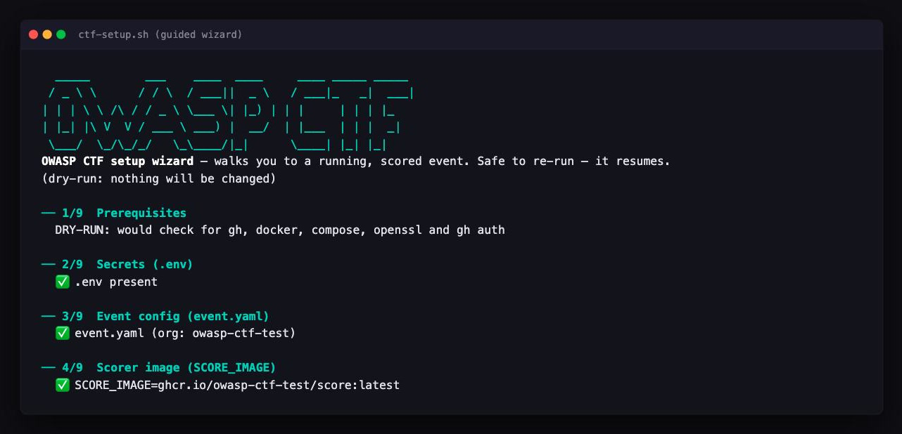
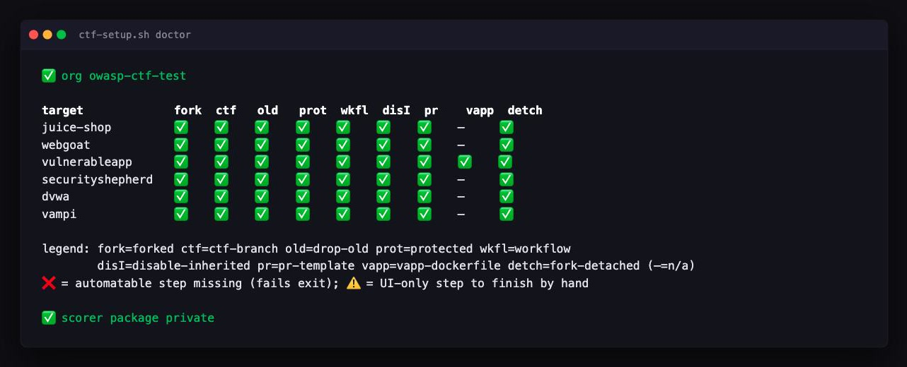

[← Docs home](index.md)

# Hosting

Everything you need to stand the kit up: prerequisites, the poll-vs-push
choice, the GitHub OAuth app contestants sign in with, and how event config
reaches the app. For the happy-path command sequence see the
[README Quickstart](https://github.com/dcotelo/ctf-in-a-box#quickstart); for
running the event once it is up see [docs/operations.md](operations.md).

## Quickstart: zero to a scored event

**The fastest path is the wizard** — run `ctf-setup.sh` with no subcommand and
it walks the whole sequence below. It **asks for each value inline** — your box
URL, the `event.yaml` fields (org, admins, **which modules to enable**, dates),
and the App/OAuth credentials — showing the instructions and GitHub URL for
each, and writing `.env` and `event.yaml` for you as you answer. No editing
config by hand between steps. It does every automatable step, guides + verifies
each UI-only one, and resumes if you stop:

```sh
./setup/ctf-setup.sh            # guided, prompts for values, resumable
```

Every discrete step is also its own subcommand — `check`, `secrets`, `org`,
`render`, `upgrade`, `teardown`, `doctor`, `app-manifest`, `app-config`,
`oauth-app`, `oauth-config` — with the global flags `--dry-run` (print
mutating commands instead of running them), `--config <path>` (default
`event.yaml`) and `--out <path>` (default `.env`, for `secrets`). The
numbered sequence below names each one where it's used; `teardown` is covered
in [operations.md](operations.md#running-an-event).



<sup>The wizard, mid-run: every value is asked for inline with the GitHub page
it comes from, and the run resumes wherever you stopped.</sup>

**The modules question drives the rest of the wizard.** It offers the module
ids this build knows (`secure-development quiz classic`) and then asks only
what the ones you picked actually need:

| You enable | The wizard asks | The wizard skips |
|---|---|---|
| `secure-development` | targets, `score_ingest` (poll/push) | — |
| `quiz` only | nothing extra | targets, score ingest, the scorer image, the poll GitHub App, and org fork-provisioning |
| `classic` only | nothing extra | the same set `quiz` only skips |
| both | targets, `score_ingest` | — |

A quiz-only event is never asked to pick vulnerable apps it will never fork,
and the `event.yaml` it writes has **no `secure-development` block at all** —
because presence is what enables a module. The quiz's own knobs (max attempts,
retry cooldown) are runtime `/admin` settings stored in Redis, not `event.yaml`
fields, so the wizard does not ask for them either. Re-running the wizard over
an existing config defaults the modules question to what that file already
declares, so a resumed run never silently switches your event to a different
shape. At least one module must be enabled — an answer naming none (or an id
this build doesn't know) is re-asked rather than written.

The rest of this section is the same sequence as explicit commands, for when
you'd rather drive it yourself or script it. Each step is either a
`ctf-setup.sh` command or a **UI-only** step GitHub forces you through by hand
(marked below); `ctf-setup.sh` never mints credentials or creates orgs for you.

```sh
# 0. Verify tooling: gh auth, docker, docker compose v2, openssl.
./setup/ctf-setup.sh check

# 1. Clone the repo and work from its root.
git clone https://github.com/dcotelo/ctf-in-a-box && cd ctf-in-a-box

# 2. Generate .env — BETTER_AUTH_SECRET, SRH_TOKEN, SCORER_TOKEN, REDIS_PASSWORD,
#    EVENT_URL, SCORE_INGEST=poll, and empty App/OAuth/SCORE_IMAGE fields to fill later.
./setup/ctf-setup.sh secrets

# 3. Build + push the scorer image, then set SCORE_IMAGE in .env by hand.
#    Pin linux/amd64 — GitHub runners are amd64; an arm64 image (the default on
#    Apple Silicon) fails scoring with "no matching manifest for linux/amd64".
docker login ghcr.io   # token with write:packages
docker buildx build --platform linux/amd64 -t ghcr.io/<your-org>/score:latest --push scorer/
#    MANUAL: edit SCORE_IMAGE=ghcr.io/<your-org>/score:latest in .env
#    (the wizard builds + pins amd64 for you at step 4)

# 4. Create your event config from the example, then edit it.
cp event.yaml.example event.yaml
#    MANUAL edit: github.org, modules.secure-development.targets,
#    admins=[your login].  (The URL is EVENT_URL in .env, not here.)

# 5. Create the disposable GitHub org — UI-ONLY, ctf-setup never creates it:
#    https://github.com/account/organizations/new
```

```sh
# 6. Sync GitHub App (poll auth). Opens a pre-filled creation form:
./setup/ctf-setup.sh app-manifest
#    UI-ONLY: Create App → Generate a private key (.pem) → note the App ID →
#    Install App on the event org. Then wire the key + App ID into .env:
./setup/ctf-setup.sh app-config --app-id <id> --pem ~/Downloads/<app>.private-key.pem
#    Add --installation-id <n> to pin the install; otherwise sync
#    auto-discovers it at runtime.

# 7. Sign-in OAuth app (separate from the App above). Opens the page and
#    prints the exact field values:
./setup/ctf-setup.sh oauth-app
#    UI-ONLY: fill the fields with callback <EVENT_URL>/api/auth/callback/github
#    → Register → Generate a client secret → copy Client ID + secret. Then:
./setup/ctf-setup.sh oauth-config --client-id <client id>
#    The secret is read from a hidden prompt — never on the command line.

# 8. Provision the event org. Dry-run first, then for real:
./setup/ctf-setup.sh org --dry-run
./setup/ctf-setup.sh org
#    org forks the targets, creates + protects the `ctf` branch, COMMITS
#    ctf-score.yml to each fork, disables inherited workflows, and mirrors
#    SCORE_IMAGE into the org's GHCR. Finish the UI-ONLY steps it prints:
#      (a) detach each fork from its fork network (Settings → Leave fork
#          network);
#      (b) keep ghcr.io/<org>/score PRIVATE and grant each fork Read under the
#          package's Manage Actions access;
#      (c) push mode only: org Actions secrets LEADERBOARD_URL / LEADERBOARD_TOKEN.
#    Then verify provisioning:
./setup/ctf-setup.sh doctor
```

```sh
# 9. Bring the containers up. EVENT_CONFIG_B64 is REQUIRED — building the app without
#    it yields neutral defaults (empty admins → /admin 403, generic branding).
#    The profiles follow your enabled modules — see "Which profiles do I need?"
#    below; this is the poll-mode secure-development line-up.
EVENT_CONFIG_B64="$(base64 < event.yaml | tr -d '\n')" \
  docker compose --profile poll --profile app up -d --build

# 10. Verify: watch the poller heartbeat, open the app, sign in, hit /admin.
docker compose logs -f sync
#     Open $EVENT_URL, sign in with GitHub, confirm /admin loads for an admin login.
```

## Prerequisites

- Docker with Compose v2 (`docker compose version` must work).
- [`gh` CLI](https://cli.github.com), authenticated (`gh auth login`).
- `openssl` — `ctf-setup.sh check` requires it (used for secret generation).
- A GitHub org for the event — one free org per event.
- `docker login ghcr.io` with a `write:packages` token. The `org` subcommand
  ends with `docker push ghcr.io/<org>/score:latest`, so it needs write access
  to your own org's packages.
- A scorer image named by `SCORE_IMAGE` in `.env`. There is no default, and
  `ctf-setup org` refuses to run until it is set.

Build your own scorer from the engine in `scorer/` — that is the
self-contained path and it needs no upstream access:

```sh
docker buildx build --platform linux/amd64 -t ghcr.io/<your-org>/score:latest --push scorer/
```

(`--platform linux/amd64` is required — GitHub runners are amd64, and
`ctf-setup org`'s mirror step refuses a non-amd64 image.)

The upstream image `ghcr.io/owasp-ctf/score` is private with no formal access
process; if the OWASP-CTF maintainers grant you access, point `SCORE_IMAGE` at
it instead. Either way `ctf-setup org` mirrors whatever `SCORE_IMAGE` names
into your event org so the forks' Actions can pull it. Authoring a rubric and
building the image is covered in [docs/scorer.md](scorer.md).

## Fork setup and the contest flow

Each target is a specific **upstream** app pinned to a source ref — that pin is
the source of truth (there is no middle-man fork). The scorer judges a fork of it
with the vendored rubric, and the *scoring baseline* image is the stock, unpatched
build that [`stock-scores-zero`](operations.md#verifying-it-works) proves scores
`0 / N`:

> The per-target upstream repo and pinned ref below are sourced from
> [`setup/targets.tsv`](https://github.com/dcotelo/ctf-in-a-box/blob/main/setup/targets.tsv),
> which `ctf-setup org` reads to fork each target. Keep this table in sync with that file.

| Target | Upstream repo | Source ref | Scoring baseline (pinned image) |
|---|---|---|---|
| `juice-shop` | `juice-shop/juice-shop` | tag `v20.0.0` | `bkimminich/juice-shop:v20.0.0` |
| `webgoat` | `WebGoat/WebGoat` | tag `v2025.3` | `webgoat/webgoat:v2025.3` |
| `vulnerableapp` | `SasanLabs/VulnerableApp` | tag `2.1.37` (commit `bad68b1`) | `sasanlabs/owasp-vulnerableapp:2.1.37` |
| `securityshepherd` | `OWASP/SecurityShepherd` | commit `662771b` | self-build (no stock image) |
| `dvwa` | `digininja/DVWA` | commit `d45ba3c` | `ghcr.io/digininja/dvwa@sha256:091498ce…` |
| `vampi` | `erev0s/VAmPI` | commit `f16052d` | `erev0s/vampi@sha256:0a5a224b…` |

`ctf-setup.sh org` forks each target into your event org, commits the scoring
workflow (`.github/workflows/ctf-score.yml`) to each fork's `ctf` branch, and
mirrors your `SCORE_IMAGE` into the org's GHCR. (The separate `render`
subcommand writes the workflows to `dist/workflows/` for offline inspection
without committing.) It automates the whole per-fork setup, is idempotent (safe to
re-run — each step is skipped once already satisfied), and leaves only three
GitHub-UI-only steps for you to finish by hand. Run `ctf-setup.sh doctor`
afterward: it prints a **status matrix** (one row per target, one column per
step) so the whole org's provisioning is scannable at a glance, then reports
each fork's **scoring-workflow version** (see
[Upgrading the scoring workflow](#upgrading-the-scoring-workflow)) and each
fork's **package Read grant**, the one step with no API in either direction.



**Automated by `ctf-setup org`** (one pass per target):

1. **Fork** the target from its pinned upstream repo/ref into your event org.
2. **Create and default the `ctf` branch** at that pinned ref (and drop the
   fork's old `master`/`main` default branch).
3. **Protect the `ctf` branch** so a contestant can never merge their patch —
   the PR is *scored, not merged*. It installs a minimal rule requiring one
   approving review:

   ```sh
   gh api -X PUT repos/<org>/<repo>/branches/ctf/protection --input - <<'JSON'
   { "required_status_checks": null, "enforce_admins": false,
     "required_pull_request_reviews": { "required_approving_review_count": 1 },
     "restrictions": null, "allow_force_pushes": false, "allow_deletions": false }
   JSON
   ```

4. **Install the scoring workflow**: renders and commits
   `.github/workflows/ctf-score.yml` on the `ctf` branch from the in-repo
   template.
5. **Disable the fork's inherited/upstream workflows** (everything except
   `ctf-score.yml`), so only the scoring Action runs.
6. **Install the PR template** (`.github/PULL_REQUEST_TEMPLATE.md`) on the
   `ctf` branch.
7. **`vulnerableapp` only** — install the Dockerfile it needs to build.
8. **Mirror `SCORE_IMAGE`** into the org's GHCR (once, after all targets),
   refusing a non-amd64 image so scoring can't fail at runtime — GitHub
   runners are amd64; an arm64-only image (e.g. built on Apple Silicon) makes
   the scoring Action fail with `no matching manifest for linux/amd64`.

**Manual — GitHub UI only, no API to perform them.** GitHub has no endpoint to
*do* these, but `doctor` confirms the first two by API (their result is
queryable) and shows ✅ once done — only the third is a blind reminder:

1. **Create the event org** itself.
2. **Detach each fork from the fork network** (repo Settings → *Leave fork
   network*, UI-only). This makes the event-org repo a standalone root, so
   contestant PRs default to *your* repo (not upstream) and contestants can
   fork it themselves. `doctor` verifies via the repo's `.fork` flag (✅
   detached / ⚠️ still a fork).
3. **Keep the `ghcr.io/<org>/score` package private** and **grant each fork
   Read** under the package's *Manage Actions access* (container visibility is
   UI-only). The rendered workflow logs in to GHCR with the runner
   `GITHUB_TOKEN`, which the Read grant makes sufficient. `doctor` verifies the
   package is private via its `.visibility`.

   The per-fork grant has no read endpoint, so `doctor` verifies it **by
   observation** instead: the rendered workflow pulls the scorer image in its
   own step (`Pull scorer image`), and `doctor` reads each fork's recent
   scoring runs for that step's outcome — ✅ *granted* (a run pulled it),
   ❌ *MISSING* (a run was refused), or ⚠️ *unverified* (no run has reached
   the pull yet). It fails closed: an API error, or anything it cannot read,
   reports unverified, never granted.

   This is the only provisioning step with no API, and it used to be the only
   one whose failure looked like something else — an unpulled image failed
   inside the scorer step and posted "Scoring did not complete" to the
   contestant's PR, so the contestant re-pushed a patch that was never judged
   while the organizer had no reason to look at the package settings. The
   workflow now names the cause in the run's step summary and in the PR
   comment, and says plainly that it is a setup problem rather than a verdict
   on the submission.

   **Already-provisioned forks keep the old workflow** until it is re-applied
   — see [Upgrading the scoring workflow](#upgrading-the-scoring-workflow)
   below. A fork still on the old one has no `Pull scorer image` step, so
   `doctor` reports it as ⚠️ unverified — correctly: it has not been observed
   either way.

   Note that this includes forks that have **scored successfully many times**.
   Under the old workflow the pull happened inside `Run scorer`, where it
   cannot be read back separately, so a working grant is invisible to
   `doctor` until that fork runs the upgraded workflow once. ⚠️ here means *not
   observed*, never *not granted*. Re-triggering any existing PR on an
   upgraded fork (close, reopen) is enough to settle it.

### Upgrading an event that predates the Redis password

Redis runs with `requirepass`, and `docker-compose.yml` reads that password
from `REDIS_PASSWORD` with `:?` — so an `.env` written before this change
**does not start a weaker stack, it does not start at all**:

```
error while interpolating services.srh.environment.SRH_CONNECTION_STRING:
required variable REDIS_PASSWORD is missing a value: set REDIS_PASSWORD in
.env (setup/ctf-setup.sh secrets generates one; see docs/hosting.md)
```

(It names `srh` rather than `redis` only because that is the first place
compose resolves the variable — both services need it.)

That is deliberate. A security control whose variable can go missing and
leave the control silently off is the failure this change exists to remove.
`doctor` flags it before you get there, with a generated value to paste. To
fix it by hand, add one line to `.env` and bring the stack back up:

```sh
echo "REDIS_PASSWORD=$(openssl rand -hex 24)" >> .env
docker compose --profile poll --profile app up -d
```

Nothing else changes: no data migration, and the `redis-data` volume is
untouched. Only `srh` is ever given the password, and only `srh` can reach
Redis — `app`, `scorer` and `sync` sit on a separate compose network with no
route to `redis:6379` at all.

If you drive Redis by hand (`docker compose exec redis redis-cli ...`), that
keeps working unchanged: the service sets `REDISCLI_AUTH`, so `redis-cli`
authenticates itself inside the container.

### Upgrading the scoring workflow

The scoring workflow lives in each fork as a committed file, so a change to
the kit's template does **not** reach an event that is already provisioned.
That matters most for the changes you least want stranded — a security fix to
`ctf-score.yml` would otherwise only reach forks by hand, one at a time.

The rendered workflow carries a version stamp copied from the template:

```
# ctf-workflow-version: 3
```

`doctor` reports every fork's version against the kit's, and names the fix
(sample output — the current template version is whatever the stamp above
says in your checkout):

```
scoring workflow version (template is v3):
  juice-shop         ✅ v3
  dvwa               ❌ v2 — stale (template v3); run: ./setup/ctf-setup.sh upgrade
  webgoat            ❌ pre-versioning — provisioned before workflow stamping; run: ./setup/ctf-setup.sh upgrade
```

Then re-apply it to exactly the forks that are behind:

```sh
./setup/ctf-setup.sh upgrade --dry-run   # see which forks would be touched
./setup/ctf-setup.sh upgrade
```

`upgrade` does the workflow step and nothing else. `org` does it too — its
workflow step compares versions rather than just checking the file exists —
but `org` also re-mirrors the scorer image, which is a multi-minute push you
do not want between you and a security fix.

Two things worth knowing:

- **Open PRs keep their current run.** The new workflow applies from each PR's
  next push (or a manual re-run), so a mid-event upgrade rolls out as
  contestants push rather than all at once.
- **A fork ahead of your checkout is left alone.** `doctor` flags it ⚠️ and
  `upgrade` skips it — that means your kit is behind, not the fork, and
  overwriting would silently revert whatever it is running.

Pre-versioning forks (anything provisioned before the stamp existed) read as
stale and are upgraded the same way.

**The contest flow:** a contestant **forks your event-org repo** into their own
account, patches the vulnerability, and opens a **pull request against
`<event-org>/<repo>:ctf`**. The scoring Action (`pull_request_target`, so a
cross-fork PR gets a writable token to comment) runs the scorer and posts the
score comment; the PR is never merged. Detaching the fork network (manual step
2 above) is what makes this fork-then-PR-back flow work.

## Poll vs push

Scores travel from the scoring Action back to your box one of two ways.
**`SCORE_INGEST` in `.env` is the operative switch** — it is what
`docker-compose.yml` and the Caddy profile actually read.
`modules.secure-development.score_ingest` in `event.yaml` documents the same
choice for readers; nothing syncs the two, so keep them matching.

| Mode | How it works | Requirements | Latency |
|---|---|---|---|
| `poll` (default) | The `sync` service polls the org's target repos for score comments | a GitHub App installed on the event org (see below) — otherwise nothing extra; works behind NAT, on a laptop, anywhere | ~30 s |
| `push` | The scoring Action POSTs the score directly to your box | A public URL; `SCORE_INGEST=push` and org Actions secrets `LEADERBOARD_URL` / `LEADERBOARD_TOKEN` | Near-instant |

Poll mode is what `scripts/smoke.sh` proves working today. Push mode's
requirements ship in-kit — the scoring workflow reads the
`LEADERBOARD_URL`/`LEADERBOARD_TOKEN` org secrets and the scorer's
`POST /score` takes bearer auth (see
[Status and upstream dependencies](operations.md#status-and-upstream-dependencies))
— and Caddy only exposes the `/score` route externally when running with the
`push` Caddyfile.

Start the poll pipeline with `docker compose --profile poll --profile app up
-d` — the `poll` profile brings up `sync` and the `scorer`, and `app` brings
up the contestant-facing app. Push mode does not need `sync` running, so it
uses `--profile push --profile app` instead (the `push` profile carries the
scorer without the poller).

### Which profiles do I need?

Compose profiles follow your **enabled modules**, not your taste: `app` is
always on, and the score-ingest profile — `poll` or `push`, whichever
`SCORE_INGEST` you set — carries everything `secure-development` needs. The
`scorer` is part of that module (it exists to score PRs against forked
targets), so it carries both ingest profiles — `["poll", "push"]` — while
`sync` carries `["poll"]` alone, since push mode has the fork's Action POST
to the scorer directly and needs no poller. A quiz-only event must not be
asked to pull a scorer image it has no reason to own.

**This is why `secure-development` is the one module you cannot switch on from
`/admin`.** Quiz and Classic can be toggled during an event without a rebuild,
because enabling one needs a route, a nav link and a tab — all of which already
exist. Secure Development needs the containers in this table, and the profile
list is fixed when you run `up`: the app cannot start a `scorer` that was never
brought up, so a runtime toggle would enable a module whose services are not
there. Its forks are the other half of the same problem — only `ctf-setup.sh`
can create those. See
[ADR 52](decisions.md#adr-52-modules-are-switched-at-runtime-secure-development-is-configured-at-setup).

So the `modules:` block below decides the profiles you need **and** decides
Secure Development permanently; for Quiz and Classic it only decides what the
event starts with.

**Every one of these is a `--build`, so every one needs `EVENT_CONFIG_B64`.**
Export it once, in the same shell — without it the build silently bakes
neutral defaults, including an empty `admins` list that 403s everyone out of
`/admin`:

```sh
export EVENT_CONFIG_B64="$(base64 < event.yaml | tr -d '\n')"
```

| `modules:` in your `event.yaml` | Command |
|---|---|
| `secure-development` (poll mode), with or without `quiz`/`classic` | `docker compose --profile poll --profile app up -d --build` |
| `secure-development` (push mode), with or without `quiz`/`classic` | `SCORE_INGEST=push docker compose --profile push --profile app up -d --build` |
| `quiz` and/or `classic`, no `secure-development` | `docker compose --profile app up -d --build` |

`ctf-setup.sh wizard` prints (and offers to run) the right one for the
`event.yaml` you configured, so you do not have to pick by hand.

Prefer a cloud VM over your own machine? [Deploy on AWS](aws.md) ships a
Terraform module for a single-shot EC2 deploy — `terraform apply` up,
`terraform destroy` down.

### Poll auth: GitHub App

`sync` needs a token to read the event org's target repos, and a GitHub App
is the only supported poll auth: org-scoped, auto-expiring, revocable, and not
tied to a person. Each organizer creates their **own** App from
[`sync/app-manifest.json`](https://github.com/dcotelo/ctf-in-a-box/blob/main/sync/app-manifest.json)
and installs it on their event org — there is no shared, central App, so the
private key stays yours.

`ctf-setup.sh` assists the two error-prone parts; you still click Create and
Install in GitHub's UI (the script cannot mint credentials for you):

```bash
# 1. Open a pre-filled App-creation form against your event org.
ctf-setup.sh app-manifest
#    In the browser: Create the App, "Generate a private key" (downloads a
#    .pem), note the App ID, then "Install App" on the event org.

# 2. Wire the downloaded key + App ID into .env (base64-encodes the PEM).
ctf-setup.sh app-config --app-id <id> --pem ~/Downloads/<app>.private-key.pem
#    Add --installation-id <n> to pin the install; otherwise sync
#    auto-discovers it at runtime.
```

This sets `GITHUB_APP_ID` / `GITHUB_APP_PRIVATE_KEY` (base64-encoded PEM) and,
optionally, `GITHUB_APP_INSTALLATION_ID` in `.env`. Both `GITHUB_APP_ID` and
`GITHUB_APP_PRIVATE_KEY` are required — `sync` refuses to start without them.
You can also set all three by hand instead of using the helpers.

## GitHub OAuth app

Contestants (and admins) sign in with GitHub, so you need an OAuth app —
separate from the sync GitHub App above. OAuth apps have no manifest/create
API, so this is a guided flow rather than an auto-filled one:

```bash
# 1. Open GitHub's new-OAuth-App page for the event org and print the exact
#    field values to paste (callback = <EVENT_URL>/api/auth/callback/github).
ctf-setup.sh oauth-app
#    In the browser: fill the printed fields, Register, then "Generate a new
#    client secret" and copy the Client ID + secret.

# 2. Wire them into .env. The secret is read from a hidden prompt — never on
#    the command line or in shell history.
ctf-setup.sh oauth-config --client-id <client id>
```

This sets `GITHUB_CLIENT_ID` and `GITHUB_CLIENT_SECRET` in `.env`; the app
reads them at runtime. `EVENT_URL` in `.env` is **the** event URL — Caddy, the app's
auth flow, the HTTPS start-up guard, the CSRF origin check and the leaderboard
link in every fork's score comment all read it, and nothing else carries a
second copy. `event.yaml` used to have a `url:` field beside it; it was a
deployment fact in the event file, it disagreed silently, and a build now
fails if one is left behind. You can also set both by hand instead of using the helpers, and you may
register the OAuth app on your personal account rather than the org.

> **Use HTTPS for any real event.** Set `EVENT_URL` to `https://<your-domain>`
> (not `http://`) for anything beyond local testing. Caddy auto-provisions TLS
> for a real domain, and the sign-in session cookie is only marked `Secure`
> when the URL is HTTPS — over plain `http://` the session cookie can be sniffed
> on the wire, which for an organizer login means admin takeover. `http://localhost`
> is fine for a local trial only.
>
> **This is enforced, not just advised.** A production start with an
> `http://` `EVENT_URL` pointing at anything other than loopback fails the
> startup check in `apps/web/src/instrumentation.ts`: the `app` container comes
> up but answers `500` to every request, and the first lines of
> `docker compose logs app` name the variable, the value, and the fix. The
> check runs at server start only — `pnpm build` is unaffected, so a build
> machine needs no event config.
>
> If a deployment is deliberately TLS-less (a closed lab, an isolated
> classroom network) set `ALLOW_INSECURE_EVENT_URL=1`. It downgrades the
> refusal to a startup warning that says sessions on that deployment are
> sniffable by design. It is not for TLS terminated upstream — in that setup
> the public URL is still `https://`, so `EVENT_URL` should say `https://` and
> the check passes on its own.

## Configuration

`event.yaml` uses a **modules** schema. Platform settings (`event`, `github`,
`admins`) sit at the top level; challenge content is
namespaced under `modules.<name>`, one block per registered module id. Three
ids are registered today:

```yaml
modules:
  secure-development:
    targets: [juice-shop, dvwa]    # any subset of the six
    score_ingest: poll             # poll | push
  quiz: {}                        # single/multi-select question bank, scored
                                    # app-side — see docs/operations.md's "Quiz"
  classic: {}                     # jeopardy-style flag board, scored app-side
                                    # — see docs/operations.md's "Classic"
```

**A module is enabled by being present.** There is no `enabled:` key: a
module is live because its key appears under `modules:`, and disabled because
its block is omitted entirely — which is what keeps its nav entry,
leaderboard columns, and admin section from appearing at all. Writing
`quiz: { enabled: false }` would *enable* `quiz`; the `enabled:` field is not
read by anything.

Enabling a module changes the **landing page**, not just the nav: the
platform frame (event name, dates, countdown, CTAs, Discord link, progress
card) stays the same, but each enabled module contributes its own tagline,
hero paragraph, "what to expect" section and steps, so the home page always
describes exactly the modules an event actually runs — a quiz-only event
never advertises forking a target or opening a PR. See
[docs/modules.md §5](modules.md#section-5-ui--presentation-contract) for the `home`
block contract.

`modules.secure-development.targets` is still the field that drives the
app's target list, nav, challenge browser, and leaderboard columns for that
module — nothing about that changed. A second module block is legal: all
three readers of `event.yaml` — the app's generator
(`apps/web/scripts/generate-event-config.mjs`), the poll service's config
loader (`sync/src/config.js`'s `KNOWN_MODULES`), and the provisioning
script (`setup/ctf-setup.sh`'s `KNOWN_MODULES`) — recognize
`secure-development`, `quiz`, and `classic` as known ids and reject anything
else loudly.
Adding `quiz:` turns on a real second module: a "Quiz" nav link and a `/quiz`
page for contestants, a Quiz section in `/admin` for authoring questions
(prompt, choices, correct answer(s), points, order) and tuning its two
retry-gate knobs, and quiz points added on top of the combined leaderboard —
see [docs/operations.md](operations.md)'s "Quiz" section for the organizer
walkthrough and [docs/modules.md §5](modules.md#section-5-ui--presentation-contract)
for the underlying contract.

**`secure-development` is not required — a single module is enough to run an
event.** `sync`'s config loader tolerates its absence (`sync/src/config.js`'s
`loadConfig` returns `null` when `modules.secure-development` is missing) and
`ctf-setup.sh`'s `org`/`render`/`doctor` each skip fork-based provisioning and
report "nothing to provision/check" instead of failing. What's still an error
in both readers is a `modules:` block that's missing entirely, or a key
neither recognizes at all — the tolerance is specifically for a *known*
module simply not being configured, not for a malformed file. A quiz-only
`event.yaml` (`modules: { quiz: {} }`, no `secure-development` block at all)
is therefore a supported event on its own: `/challenges` 404s (that route
doesn't exist without the module that owns it), and `/how-to-play`, `/rules`,
the landing page, the leaderboard, and `/profile` all compose from whatever
modules *are* enabled instead of assuming `secure-development` is one of
them. See [docs/modules.md §5](modules.md#section-5-ui--presentation-contract) for
the UI composition contract and [the ADR](decisions.md#adr-24-tolerating-a-missing-module-vs-rejecting-an-unknown-one)
for why the missing-vs-unknown distinction is drawn where it is.

**Boot a quiz-only event with `EVENT_CONFIG_B64="$(base64 < event.yaml | tr -d '\n')" docker compose --profile app up -d --build`**
— just the `app` profile, and the same `EVENT_CONFIG_B64` every `--build`
needs. The score-ingest profiles (`poll` / `push`) carry
`secure-development`'s two services, `sync` and the `scorer`, and a quiz-only
event has no use for either: nothing to poll, and no scorer image to pull
(the compose fallback is the maintainers' private image, so asking for it
fails the bring-up). See the [profiles table](#which-profiles-do-i-need)
above.

If you do pass `--profile poll` anyway — say you enabled `secure-development`
mid-event and then dropped it again — `sync` starts, logs `ctf-sync: no
polled module enabled, nothing to do` and exits `0` rather than entering the
poll loop (`sync/src/index.js`'s `main()`), and `docker-compose.yml`'s `sync`
service is `restart: on-failure` (changed from `unless-stopped`) so that
clean exit isn't treated as a crash and restarted forever. You still need a
`SCORE_IMAGE` for the scorer that profile also brings up.

Copy `event.yaml.example` and fill in `github.org`, the `modules:` you want,
and `admins` (GitHub logins) — the URL is not in this file, it is `EVENT_URL`
in `.env`, because one `event.yaml` is deployed to a box, to AWS and to fly.io
on three different hostnames. Or let
[the wizard](#quickstart-zero-to-a-scored-event) write the file from your
answers, which is the same schema with none of the YAML. Only the modules you
enable need their own settings: `modules.secure-development.targets` and
`score_ingest` for that one, nothing for `quiz` or `classic`. There is
deliberately **no `teams:` or `hints:` block** — both keys existed once,
were never read, and were removed rather than left as documentation-of-intent
(ADR 31's amendment; `generate-event-config.mjs` warns if it finds either).
Team size is the `/admin` Event tab's "players per team" knob, and **hints
have exactly one switch: `/admin`'s hint controls**, a runtime override
stored in Redis. It is live, survives restarts,
and governs everything — whether a hint can be bought, whether the challenges
page offers the button, and whether the leaderboard shows hint penalties. There
is no environment variable and no rebuild involved; see
[docs/operations.md](operations.md#organizer-admin-panel).

The one thing an organizer setting cannot do is turn hints on without
`UPSTASH_REDIS_REST_*` credentials — hint text lives only in Upstash, so
without them there is nothing to reveal. What a
module must provide to
plug in — config block, scoring contract, transports, security requirements,
provisioning — is documented in [docs/modules.md](modules.md).

### Rebuilding the app after a config change

The contestant app (`apps/web/`, vendored — see
[`apps/web/VENDORED.md`](https://github.com/dcotelo/ctf-in-a-box/blob/main/apps/web/VENDORED.md))
bakes its event name, dates, URL, enabled-target list, fork org and optional
Discord link from `event.yaml` at **image-build time**, via the
`EVENT_CONFIG_B64` build arg. The fork org also drives every "fork this repo"
link the app renders, so contestants are pointed at the org `ctf-setup org`
actually forked into.

Compose only rebuilds an image when told to, so `up -d` alone will not pick up
an `event.yaml` edit:

```sh
EVENT_CONFIG_B64=$(base64 < event.yaml | tr -d '\n') docker compose --profile app build app
docker compose --profile poll --profile app up -d   # quiz-only: --profile app alone
```

Building without `EVENT_CONFIG_B64` falls back to the neutral "OWASP CTF"
defaults. See `apps/web/scripts/generate-event-config.mjs` for the full
`EVENT_CONFIG` yaml > `EVENT_*` env var > default precedence, and
[docs/architecture.md](architecture.md#build-time-config-flow) for the whole
build-time config flow.
