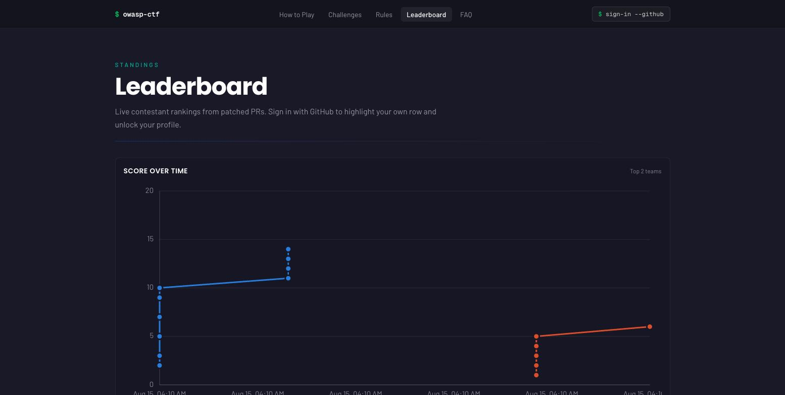

# CTF-in-a-box

**A self-hosted control plane for security-learning events** — run at a
university, a high school, an OWASP chapter, a meetup, from one box and one
free GitHub org.

The real contestant app, recorded from <code>scripts/dev-stack up</code> with
seeded demo players. Hover the graph to read every team's score at that moment;
expand a team for its roster and its flags, patched and still open.

CTF-in-a-box is a control plane, not a single game. It gives an event its
shared spine — a GitHub org, team registration, a live leaderboard, an
organizer admin panel, and the scoring pipeline that feeds it — and **modules**
plug challenge content into that spine. Three modules ship today — **OWASP
Secure Development CTF**, **Quiz** and **Classic CTF** — and any subset can
run alone or together; the box is built to host further modules on the same
spine. The [module contract](modules.md) is the boundary between platform and
module.

The **Secure Development** module teaches defence rather than attack: a
contestant forks a deliberately vulnerable app, finds the flaw, **patches** it,
and opens a pull request. The pipeline scores the patch and the score lands
on a **team** leaderboard. **Quiz** and **Classic** need none of that
machinery — no forks, no GitHub org, no scoring pipeline. They are graded
inside the app, so an event running only those boots with a single compose
profile. Their organizer guides are
[Quiz](operations.md#quiz) and [Classic](operations.md#classic).

Until now, running one meant standing up Vercel, Upstash, Lambda and DynamoDB,
holding the cloud bill, and having access to a private scoring image. This kit
removes all of that: everything runs from Docker Compose on a machine you
already have, plus one free GitHub org for the forks. The rubrics for all six
targets ship inside the box, so there is no private image to request and no
scoring code to write.

## What you get

**The platform** (control plane, module-independent):

| Feature | What it means for you |
|---|---|
| **Team scoring** | Per-team standings, self-registration, captains and join codes; shared flags dedupe so they count once. |
| **Live leaderboard + graph** | A ranked team leaderboard with a CTFd-style score-over-time graph from real per-solve timestamps. |
| **Organizer admin panel** | `/admin`, allowlisted: freeze the leaderboard, schedule scoring and registration windows, toggle hints, author each module's content, reset between rehearsals. |
| **Scoring pipeline** | GitHub-Actions-fed, poll or push, one audited score writer — the transport for modules graded outside the app. Quiz and Classic bank points directly and never touch it. |
| **Poll or push** | Poll mode has zero inbound network surface; push mode is near-instant with a public URL. |
| **One box, no cloud** | Docker Compose plus one free GitHub org. Nothing billed, nothing phones home. |

**The Secure Development module** (graded through GitHub):

| Feature | What it means for you |
|---|---|
| **Patch-to-score scoring** | Contestants patch the vuln and open a PR; the pipeline scores it. Stock scores 0, a correct patch earns its points. |
| **6 targets, 321 challenges** | Juice Shop, DVWA, WebGoat, Security Shepherd, VulnerableApp, VAmPI — rubrics ship in the box. |

**The Quiz module** (graded in the app):

| Feature | What it means for you |
|---|---|
| **Instant grading, no GitHub** | Single/multi-select questions marked on submit, all-or-nothing on multi-select. No forks, no org, no pipeline. |
| **Authored from `/admin`** | Prompt, choices, answers, points, order — plus an attempt cap and retry cooldown. Live on the next request. |
| **Bulk authoring** | Author one at a time, or import and export the whole bank as one JSON bundle — the same format the classic board uses. |

**The Classic CTF module** (graded in the app):

| Feature | What it means for you |
|---|---|
| **Flags, checked instantly** | Organizer-authored challenges in categories with per-challenge points. Submissions are normalised, so casing and stray whitespace never cost a solve. |
| **Rich descriptions, bulk authoring** | A sanitised Markdown subset for descriptions; author in `/admin` or import/export the whole board as one JSON bundle. |

## A closer look

| Contestant breakdown | Challenge browser |
|---|---|
|  |  |

Captured from the contestant app running locally via <code>scripts/dev-stack up</code>
with seeded demo players. The board ranks <strong>teams</strong> by default (above) and
switches to individual standings (left); a flag solved by more than one teammate counts
<strong>once</strong>, so a team's total is less than its members' scores added up.
Branding is the neutral "OWASP CTF" default; the event name, targets, and links are
event-config driven.

## What organizers run

One guided command takes you from an empty checkout to a running, scored event —
it asks for each value inline and does every automatable step.

`ctf-setup.sh doctor` then verifies the whole org at a glance — one row per fork,
one column per provisioning step, confirming even the UI-only steps it can read
back by API.

## Targets (Secure Development module)

The module's content is a set of vulnerable targets. Enable any subset in
`event.yaml` — nine challenges for a two-hour club session, all 321 for a
semester.

| Target | Challenges | Points |
|---|---:|---:|
| `vulnerableapp` | 110 | 187 |
| `webgoat` | 69 | 137 |
| `dvwa` | 55 | 108 |
| `securityshepherd` | 40 | 79 |
| `juice-shop` | 38 | 141 |
| `vampi` | 9 | 16 |

Every target's rubric is vendored from the upstream event repo, pinned to a
single commit, and gated: a test that passes against the *unpatched* app would
be a free point for every contestant, so CI scores every rubric against the
stock upstream image and fails if anything scores above zero
(`.github/workflows/stock-scores-zero.yml`, `scripts/acceptance-target.sh`).

## Quickstart

The full, canonical sequence — tooling check, scorer image, the sync GitHub
App, the sign-in OAuth app, org provisioning, and bringing up the box with the
required `EVENT_CONFIG_B64` build arg — lives in
[Hosting → Quickstart: zero to a scored event](hosting.md#quickstart-zero-to-a-scored-event).

Poll mode is the default and needs no inbound network access — nothing has to
reach your box from the internet, so a campus network, a locked-down lab or
venue wifi works without a firewall change. Full prerequisites, OAuth setup and
the poll-vs-push choice are in [Hosting](hosting.md).

## Teams

Scoring is per team. Contestants self-register in the app — create a team to
become its captain and get a join code, or join by code; a solo player is just
a team of one. Captains manage the roster (rename, remove, transfer, disband,
regenerate the code). The leaderboard ranks teams, each row expanding to its
members with their individual points — and a flag solved by several teammates
counts **once**, so a team's total can be less than its members' scores added
up. Organizers open or close registration from the admin panel. See
[Operations](operations.md#teams).

## Organizer admin panel

Anyone in `event.yaml`'s `admins` list can sign in and reach `/admin` for a
live status view (poller heartbeat, last error, leaderboard freshness) and
runtime controls: a **freeze** switch that pauses ingestion — not fork Actions,
so PRs keep getting judged, nothing is lost, only queued until you resume — an
**open/close team registration** toggle, and a hint on/off + cost override.
Every change is recorded in a capped audit log. See
[Operations](operations.md#organizer-admin-panel) for the full picture,
including a known v1 limitation on the hint toggle's reach.

## Learn more

- [Hosting](hosting.md) — prerequisites, poll vs push, the GitHub OAuth
  app, and event config.
- [Deploy on AWS](aws.md) — single-shot Terraform deploy on one ephemeral EC2
  box (`apply` up, `destroy` down).
- [Deploy on fly.io](fly.md) — three Fly apps plus managed Redis, no box to
  administer (`deploy.sh` up, `fly apps destroy` down).
- [Operations](operations.md) — teams, the admin panel, verifying the kit,
  the local dev-stack, teardown, and live-scoring status. It also carries the
  two app-side modules' organizer guides: [Quiz](operations.md#quiz) and
  [Classic](operations.md#classic).
- [Security checklist](security-checklist.md) — the one-page pre-event walk:
  HTTPS, secrets, the private scorer image and its per-fork grant, poll vs
  push, and the admins list.
- [Module contract](modules.md) — what a CTF vertical must satisfy to plug in.
- [Architecture](architecture.md) — what runs where, how a score gets from a
  contestant's PR to the leaderboard.
- [Scorer](scorer.md) — both rubric grammars, building your own scorer image,
  and wiring the self-contained scoring workflow.
- [Decisions](decisions.md) — numbered ADRs for why the kit is built the way
  it is.

## Status

The kit is complete and tested offline: the smoke test (`scripts/smoke.sh`)
exercises the whole poll pipeline end to end, and every target's rubric is
gated against the unpatched app. Real, live-GitHub scoring depends on a small
number of changes still landing in other OWASP-CTF repos. See
[Status and upstream dependencies](operations.md#status-and-upstream-dependencies)
for the current state.

---

[Source on GitHub](https://github.com/dcotelo/ctf-in-a-box) ·
[OWASP-CTF/dc34-owasp-secure-development-ctf](https://github.com/OWASP-CTF/dc34-owasp-secure-development-ctf)
(underlying spec and target apps)
